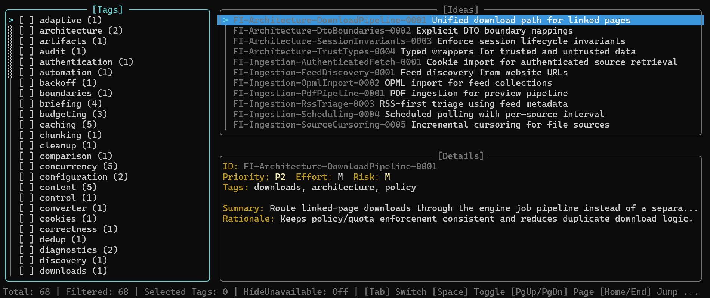

# Ministry of Future Plans

**A rigorous, text-based engine for managing speculative backlogs, architectural debt, and future ideas.**

### What is this?
This submodule provides the **tooling, schema, and workflows** to treat your project's "Future Ideas" (deferred work, nice-to-haves, post-MVP features) as code.

Instead of losing ideas in closed PRs, Slack threads, or Jira backlogs, you maintain a strictly typed, human-readable **Markdown database** (`FutureIdeas.md`). This module includes the PowerShell tools to **validate**, **analyze**, and **browse** that database via a Terminal User Interface (TUI).



---

## 📦 Installation

Add this repository as a submodule to your existing Git project. We recommend placing it in the root or a `tools/` directory.

```powershell
# Add the submodule
git submodule add <URL_TO_THIS_REPO> ministry-of-future-plans

# Initialize
git submodule update --init --recursive
```

## 🚀 Quick Start

Assuming your project structure looks like this:
```text
my-project/
├── docs/
│   └── FutureIdeas.md       # Your database (see template inside submodule)
└── ministry-of-future-plans/ # This submodule
    ├── Browse-Ideas.ps1
    ├── Validate.ps1
    └── ...
```

### 1. Browse the Backlog (TUI)
Launch the interactive terminal browser to filter, search, and view details of your ideas.

```powershell
.\ministry-of-future-plans\Browse-Ideas.ps1 -IdeasPath .\docs\FutureIdeas.md
```
*Controls: `Tab` to switch panes, `Arrow Keys` to navigate, `Space` to select tags, `Q` to quit.*

### 2. Validate Data Integrity
Ensure your `FutureIdeas.md` adheres to the strict schema (required fields, valid taxonomy, sorted order). Run this in your CI pipeline.

```powershell
.\ministry-of-future-plans\Validate.ps1 -IdeasPath .\docs\FutureIdeas.md
```

### 3. Analyze Statistics
Get a breakdown of your backlog by Priority, Risk, Effort, and Taxonomy.

```powershell
.\ministry-of-future-plans\Analyze.ps1 -IdeasPath .\docs\FutureIdeas.md
```

---

## 🚜 The Harvesting Workflow

The core philosophy of this module is **Harvesting**. When you finish a planning document or a feature implementation, you extract deferred work into the backlog using a standardized procedure.

1.  **Initialize once (new project):**
    Copy the template and create your first backlog document.
    ```powershell
    Copy-Item .\ministry-of-future-plans\docs\FutureIdeas-template.md .\docs\FutureIdeas.md
    ```

2.  **Read the Procedure:**
    See [Instruction.HarvestFutureIdeas.md](./Instruction.HarvestFutureIdeas.md) for:
    - `Initialize` mode (first-time full file creation from template)
    - `Harvest` mode (incremental patch-style updates: Adds/Updates/Merges/Uncertain)

3.  **Strict Taxonomy:**
    Ideas are organized by `TopLevel` and `SubLevel`. These must match the taxonomy table defined at the top of your `FutureIdeas.md` file.

## 📄 File Structure

*   **`Browse-Ideas.ps1`**: The interactive TUI application.
*   **`Validate.ps1`**: Linter ensuring schema compliance (use in CI).
*   **`Analyze.ps1`**: Generates statistical reports on your backlog.
*   **`common/`**: Core logic for parsing the custom Markdown format.
*   **`browser/`**: Render logic, state management, and input handling for the TUI.
*   **`docs/`**: Internal documentation and templates.

## 📜 License

See [LICENSE](./LICENSE).
